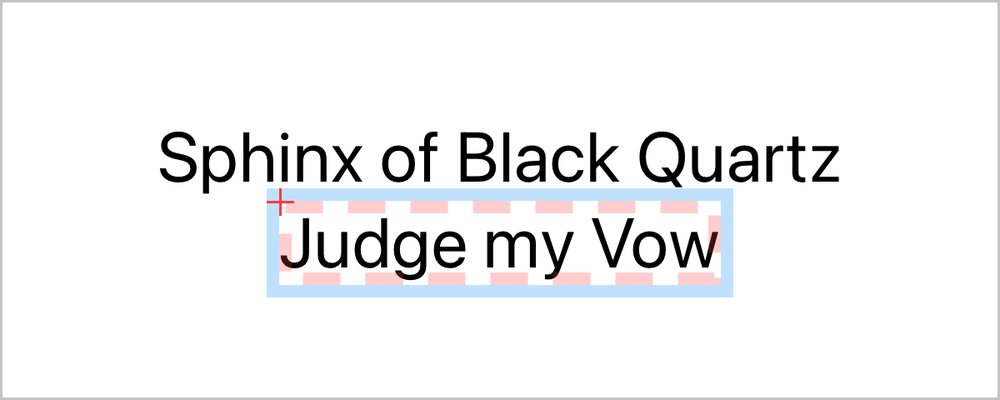
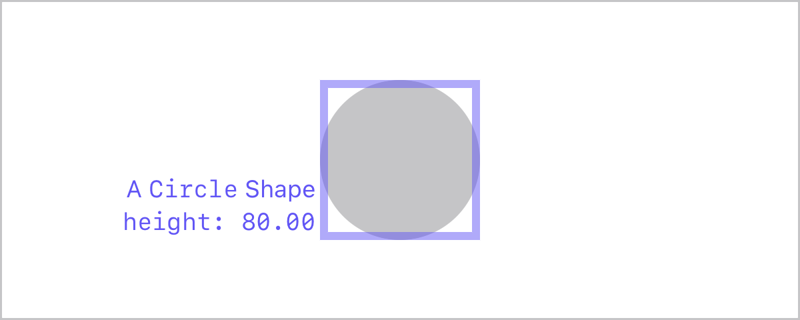

Preview Utilities
=================

Utilities for SwiftUI previews.

A collection of modifiers, additions, views, and other utilities usually useful for building previews in SwiftUI.

[Package Documentation](https://lopsae.com/preview-utilities/documentation/previewutilities)

> [!NOTE]
> Package documentation is currently a work in progress. Many of the utilities in this package
> have not been documented thoroughly.

Debug Overlay
-------------
Visualize the boundaries, origin, and safe areas of any view, without impacting its layout.

Apply the `debugOverlay()` modifier to any view to overlay the debug visualization, the original
layout of the parent view is never modified.

See the [`DebugOverlayModifier` documentation](https://lopsae.com/preview-utilities/documentation/previewutilities/debugoverlaymodifier). 

```swift
Text("Sphinx of Black Quartz")
   .font(.title)
Text("Judge my Vow")
    .font(.title)
    .debugOverlay()
```




Floating Caption
----------------
Add a floating caption, border, and size information to any view, without impacting its layout.

Apply the `floatingCaption(_:_:)` modifier to any view to overlay a floating caption, and optionally
draw a border over the parent view. The original layout of the parent view is never modified.

See the [`FloatingCaptionModifier` documentation](https://lopsae.com/preview-utilities/documentation/previewutilities/floatingcaptionmodifier).

```swift
Circle()
.fill(.tertiary)
.frame(width: 80, height: 80)
.floatingCaption(
    "A `Circle` Shape",              // caption localized string
    .height,                         // prints the height of the parent view
    .alignment(.outerLeadingBottom), // alignment for the caption
    .colorStyle(.indigo),            // sets the caption and border color
    .borderWidth(4)                  // sets the border width
)
```




Other utilities
---------------
Other utilities available in this package:
+ `.headerFooter` Preview trait to display a header and footer to push content away from safe-areas
  in device previews, and to make previews look neater.
+ `PreviewCaption` to add a caption to previews that is also easy to read in code.
+ Several Image generators that can be used to produce preview images synchronously and 
  asynchronously with different isolation contexts.
+ Several `FormatStyle` implementations for a variety of cases.


Miscellaneous
------------

This package is also a catch-all for experimental utilities that do not have an individual project
of their own. Some utilities and extensions that will eventually move elsewhere:
+ Extension inits for `Slider`, `Picker` with support for collections and style formatters.
+ Extensions for `OptionSet` to identify each option through a shift value.

As this package moves towards a 1.0 release, many of these unrelated utilities will move to separate
packages.


-----

Written with ♥ in San Francisco, California.
