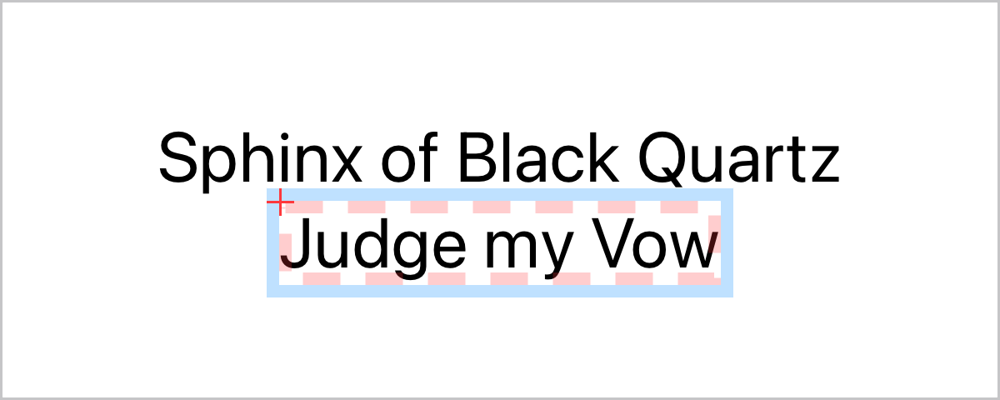
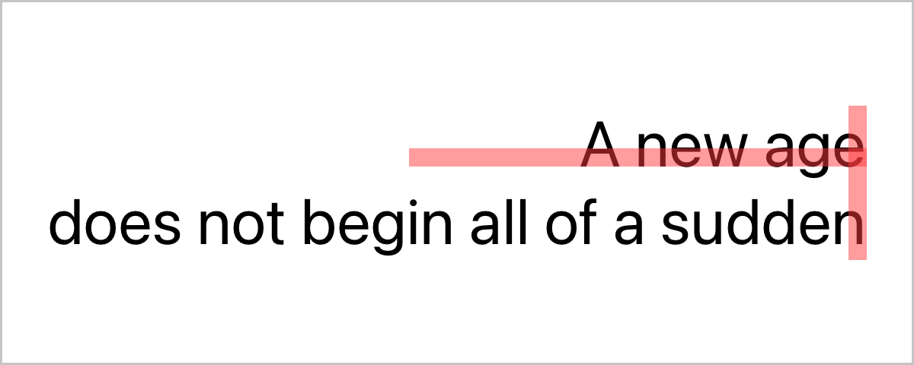
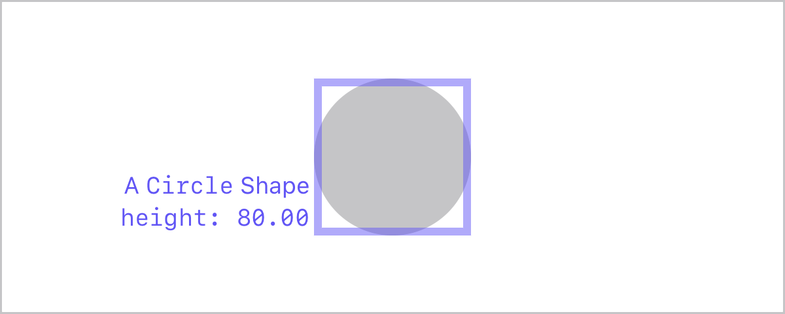

Preview Utilities
=================

Utilities for SwiftUI previews.

A collection of modifiers, views, extensions, and other utilities for building previews in 
SwiftUI.

Latest documentation: [v0.4.1][latest-documentation].

See [Package Documentation](documentation.md) for documentation of earlier versions.

> [!NOTE]
> Package documentation is actively being written. Many of the utilities in this package have not 
> been thoroughly documented yet.

[latest-documentation]: https://lopsae.github.io/preview-utilities/v0.4.1/documentation/previewutilities/


Essentials
----------

### Debug Overlay
Visualize the boundaries, origin, and safe areas of a view, without impacting its layout.

Apply [`debugOverlay()`][docs-debug-overlay-function] to a view to overlay the debug 
visualization:

```swift
Text("Sphinx of Black Quartz")
    .font(.title)
Text("Judge my Vow")
    .font(.title)
    .debugOverlay()
```



See the [Debug Overlay documentation][docs-debug-overlay-api] for more details.


[docs-debug-overlay-function]: https://lopsae.github.io/preview-utilities/v0.4.1/documentation/previewutilities/swiftuicore/view/debugoverlay(_:)
[docs-debug-overlay-api]: https://lopsae.github.io/preview-utilities/v0.4.1/documentation/previewutilities/debug-overlay-api


### Debug Alignment Guides

Visualize the alignment guides of a view, without impacting its layout.

Apply [`debugAlignmentGuide(_:_:)`][docs-debug-alignment-guide-function] to overlay a visualization
of the alignment guides:

```swift
Text("A new age\ndoes not begin all of a sudden")
.font(.title)
.multilineTextAlignment(.trailing)
.debugAlignmentGuide(.trailingFirstTextBaseline,
    .lineWidth(8),
    .fixedLength(vertical: 200),
    .anchor(.trailing)
)
```



See the [Debug Alignment Guide documentation][docs-debug-alignment-guide-api] for more details.


[docs-debug-alignment-guide-function]: https://lopsae.github.io/preview-utilities/v0.4.1/documentation/previewutilities/swiftuicore/view/debugalignmentguide(_:_:)
[docs-debug-alignment-guide-api]: https://lopsae.github.io/preview-utilities/v0.4.1/documentation/previewutilities/debug-alignment-guide-api


### Floating Caption
Add a floating caption, border, and size information to a view, without impacting its layout.

Apply the [`floatingCaption(_:_:)`][docs-floating-caption-function] modifier to a view to overlay a 
floating caption, and optionally draw a border over the owner view:

```swift
Circle()
.fill(.tertiary)
.frame(width: 80, height: 80)
.floatingCaption(
    "A `Circle` Shape",              // caption localized string
    .height,                         // prints the height of the owner view
    .alignment(.outerLeadingBottom), // sets the caption alignment
    .colorStyle(.indigo),            // sets the caption and border color
    .borderWidth(4)                  // sets the border width
)
```



See the [Floating Caption documentation][docs-floating-caption-api] for more details.


[docs-floating-caption-function]: https://lopsae.github.io/preview-utilities/v0.4.1/documentation/previewutilities/swiftuicore/view/floatingcaption(_:_:)
[docs-floating-caption-api]: https://lopsae.github.io/preview-utilities/v0.4.1/documentation/previewutilities/floating-caption-api


### Other utilities

Other utilities available in this package:
+ Several [`FormatStyle` implementations][docs-format-style-api] for a variety of cases.
+ The [Floating Alignment API][docs-floating-alignment-api] for floating content in an overlay.
+ [`PreviewCaption`][docs-preview-caption] to add a caption to previews that are also easy to read in code.
+ Several image generators that can be used to produce preview images synchronously and 
  asynchronously with different isolation contexts.


[docs-format-style-api]: https://lopsae.github.io/preview-utilities/v0.4.1/documentation/previewutilities/format-styles-api
[docs-preview-caption]: https://lopsae.github.io/preview-utilities/v0.4.1/documentation/previewutilities/previewcaption
[docs-floating-alignment-api]: https://lopsae.github.io/preview-utilities/v0.4.1/documentation/previewutilities/floating-alignments-api


Future Development
------------------

This package is also a catch-all for experimental utilities that do not have an individual project
of their own. Some utilities and extensions that will eventually move elsewhere:
+ Extension inits for `Slider`, `Picker` with support for collections and style formatters.
+ Extensions for `OptionSet` to identify each option through a shift value.


As this package moves towards a `1.0` release, many of these unrelated utilities will move to 
separate packages.


License
-------

Preview Utilities is licensed under the [MIT License](LICENSE).


-----

Written with ♥ in San Francisco, California.
